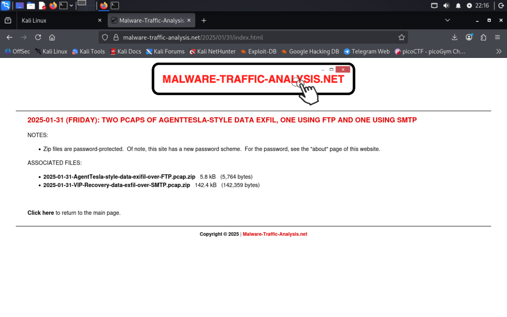
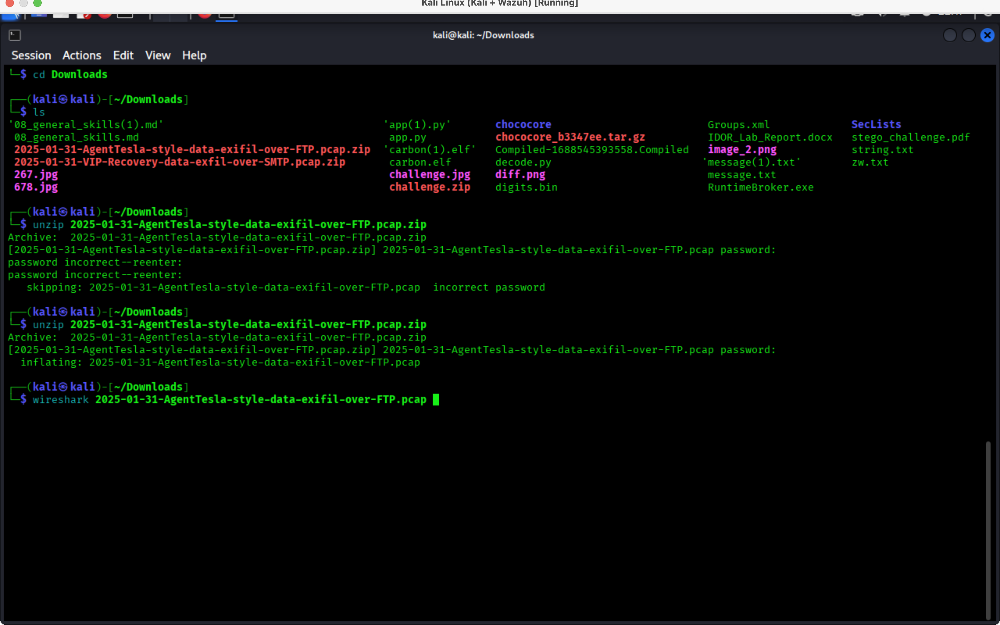
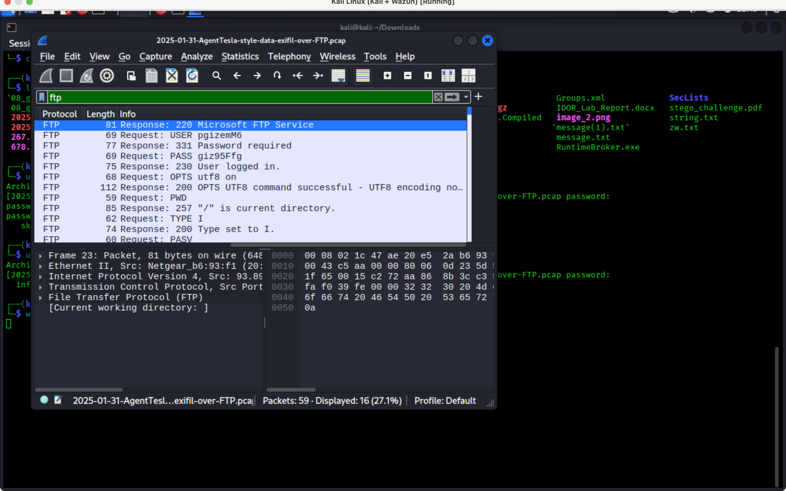
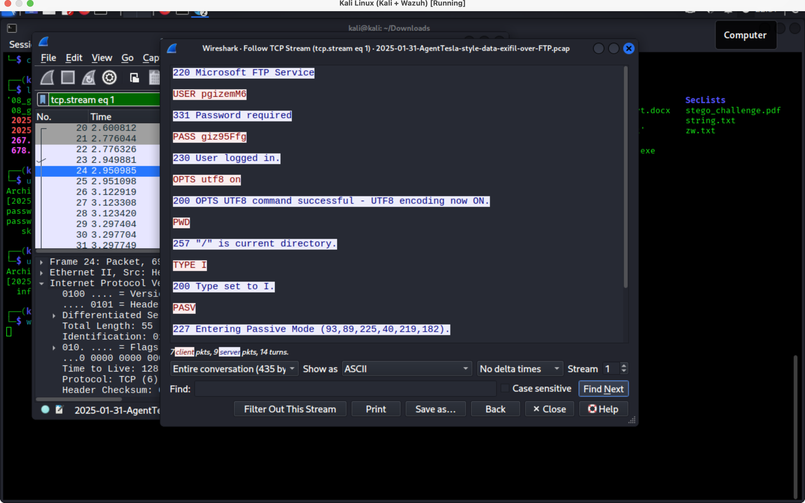
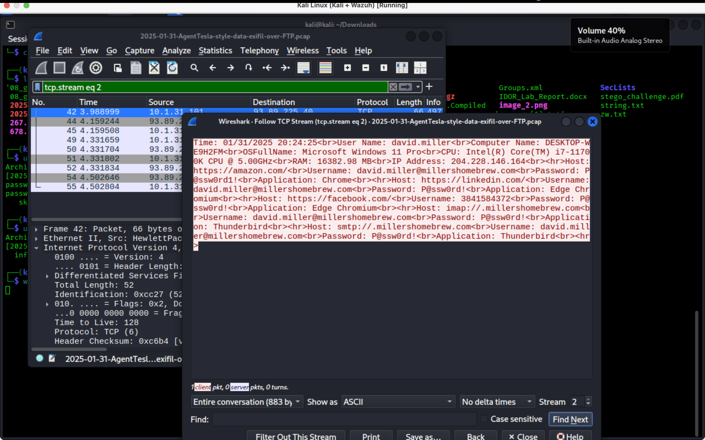
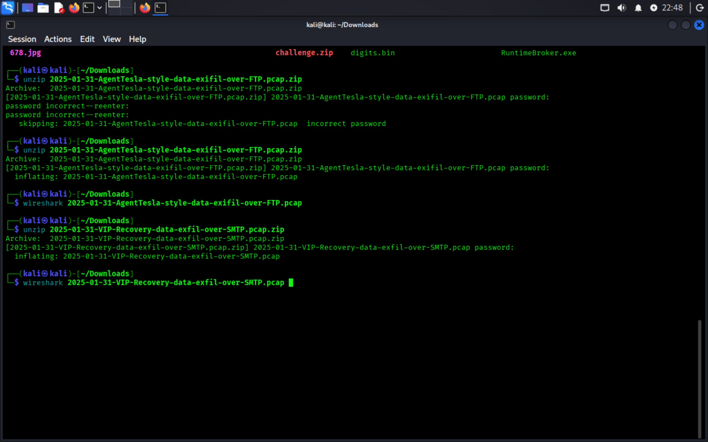
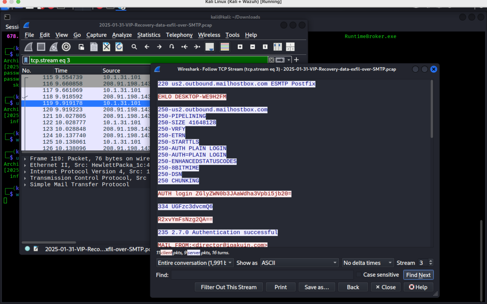
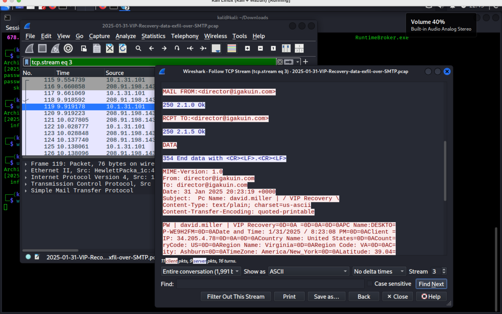
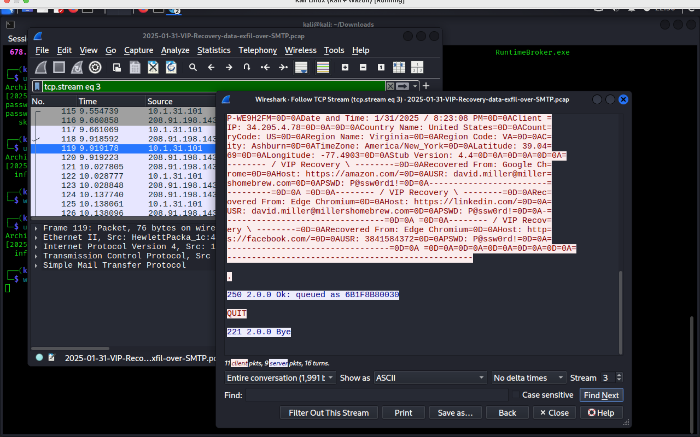

# AgentTesla Data Exfiltration Analysis (FTP & SMTP)

## Overview

This project contains a network traffic analysis of two malicious PCAP files involving AgentTesla-style credential theft and data exfiltration using:

- FTP
- SMTP

The investigation was performed in Wireshark on Kali Linux using TCP stream reconstruction and protocol analysis techniques.

The analyzed traffic demonstrates:

- Plaintext FTP credential leakage
- Credential harvesting
- Browser password theft
- Email-based exfiltration
- Victim system reconnaissance
- SMTP authentication abuse
- Data exfiltration over FTP and SMTP

---

# Objective

The objective of this project was to:

- Analyze suspicious network traffic
- Reconstruct attacker communications
- Identify exfiltrated credentials
- Extract Indicators of Compromise (IOCs)
- Understand attacker behavior
- Map observed activity to MITRE ATT&CK techniques

---

# Environment

| Component | Value |
|---|---|
| OS | Kali Linux |
| Tool | Wireshark |
| Traffic Source | Malware-Traffic-Analysis.net |
| Protocols | FTP, SMTP, TCP |
| Analysis Type | Network Forensics / DFIR |

---

# Traffic Source

The PCAP files were obtained from:

https://malware-traffic-analysis.net/

## Screenshot — Malware Traffic Analysis Source



---

# Files Analyzed

## FTP PCAP

- `2025-01-31-AgentTesla-style-data-exfil-over-FTP.pcap`

## Screenshot — FTP PCAP Extraction



---

## SMTP PCAP

- `2025-01-31-VIP-Recovery-data-exfil-over-SMTP.pcap`

---

# Methodology

The investigation included:

1. Filtering FTP and SMTP traffic
2. Reviewing packet contents
3. Reconstructing TCP streams
4. Extracting credentials
5. Identifying exfiltrated information
6. Extracting Indicators of Compromise
7. Mapping techniques to MITRE ATT&CK

---

# FTP Traffic Analysis

## FTP Authentication

The FTP session revealed successful authentication using plaintext credentials.

### Extracted Credentials

```text
Username: pgizemM6
Password: giz95Ffg
```

## Screenshot — FTP Login



---

## FTP File Upload Activity

The attacker used the `STOR` command to upload a file containing harvested credentials.

### Uploaded File

```text
PW_david.miller-DESKTOP-WE9H2FM_2025_01_31_20_24_25.html
```

## Screenshot — FTP File Upload



---

## FTP Data Stream Reconstruction

TCP stream reconstruction revealed the exfiltrated content containing stolen credentials and victim system information.

## Screenshot — FTP TCP Stream



---

# SMTP Traffic Analysis

## SMTP Authentication

The SMTP session revealed authentication activity using SMTP AUTH LOGIN.

## Screenshot — SMTP Authentication



---

## MAIL FROM / RCPT TO Analysis

The SMTP transaction showed the sender and recipient used during exfiltration.

```text
MAIL FROM: director@igakuin.com
RCPT TO: director@igakuin.com
```

## Screenshot — SMTP MAIL FROM / RCPT TO



---

## SMTP DATA Section

The DATA section contained harvested credentials and victim host information.

## Screenshot — SMTP DATA



---

## Credential Exfiltration

The malware exfiltrated credentials from multiple services and applications.

### Examples Identified

- Amazon credentials
- LinkedIn credentials
- Facebook credentials
- Thunderbird mail credentials

## Screenshot — Credential Theft



---

# Indicators of Compromise (IOCs)

## IP Addresses

```text
93.89.225.40
208.91.198.143
204.228.146.164
```

## Domains

```text
amazon.com
linkedin.com
facebook.com
mailhostbox.com
```

## Victim Host

```text
DESKTOP-WE9H2FM
```

---

# MITRE ATT&CK Mapping

| Technique | ID |
|---|---|
| Data Exfiltration | T1041 |
| Exfiltration Over Alternative Protocol | T1048 |
| Credentials from Password Stores | T1555 |
| Application Layer Protocol | T1071 |
| Email Collection | T1114 |

---

# Key Findings

- FTP credentials were transmitted in plaintext.
- The malware uploaded credential data through FTP.
- SMTP traffic contained harvested passwords.
- Victim system information was included in exfiltrated data.
- Browser and email credentials were successfully recovered from traffic.
- TCP stream reconstruction exposed attacker communications.

---

# Skills Demonstrated

- Network Traffic Analysis
- DFIR Investigation
- Wireshark Analysis
- TCP Stream Reconstruction
- IOC Extraction
- Malware Traffic Analysis
- MITRE ATT&CK Mapping
- Threat Investigation

---

# Repository Structure

```text
agenttesla-data-exfiltration-analysis/
│
├── README.md
├── report/
│   └── AgentTesla_Data_Exfiltration_Report.docx
│
├── pcap/
│   ├── 2025-01-31-AgentTesla-style-data-exfil-over-FTP.pcap
│   └── 2025-01-31-VIP-Recovery-data-exfil-over-SMTP.pcap
│
├── screenshots/
│   ├── 01_source_page.png
│   ├── 02_unzip_process.png
│   ├── 03_ftp_login.png
│   ├── 04_ftp_exfiltration.png
│   ├── 05_ftp_data_stream.png
│   ├── 06_smtp_auth.png
│   ├── 07_smtp_mail_from.png
│   ├── 08_smtp_data.png
│   └── 09_credentials_exfiltration.png
│
└── iocs/
    └── indicators.md
```

---

# Conclusion

This investigation demonstrated how AgentTesla-style malware performs credential theft and data exfiltration through FTP and SMTP protocols.

The analysis successfully reconstructed attacker communications, identified stolen credentials, extracted IOCs, and documented malicious behavior using Wireshark-based network forensics techniques.

---

# Author

Humoyun Maxmudov  
Cybersecurity Student | DFIR & SOC Enthusiast
